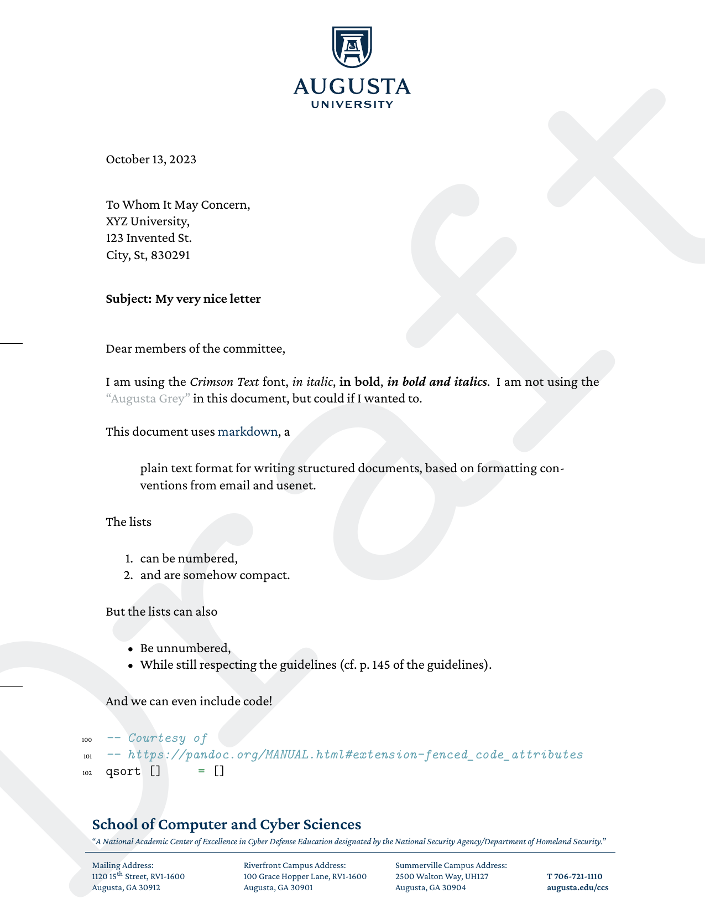

# Letterhead for Augusta University

## Presentation

This is a letterhead for Augusta University.
This template respects the brand strategy of the University (as detailed in its ["Brand Guidelines 7.23 2023.pdf"](https://augustauniversity.app.box.com/s/qma2e8nar4ui6bgg43p5lh9qmnfg3e3o) document, p. 139--140) and was approved by [Augusta University's graphic designers](https://www.augusta.edu/dcm/marketing/).

The official docx template can be found on the [DCM](https://www.augusta.edu/dcm/marketing/) website, hidden in a [box folder](https://augustauniversity.app.box.com/v/brand-templates/file/777468597182).
The template adapted to the School of Cyber and Computer Sciences is [also on box](https://augustauniversity.app.box.com/file/913457881161).
Note that those templates actually _do not_ respect the brand strategy, since they do not include foldmarks (the small lines on the left side).




## Instructions

Simply run

    make

Requires:

- pandoc (tested with pandoc 3.1.9)
- XeLaTeX (tested with XeTeX 3.141592653-2.6-0.999995 (TeX Live 2023))

If the CrimsonPro font is installed in your system, then you can comment out 

```
Path = CrimsonPro/,
```

in template.tex and delete the CrimsonPro/ folder. This way, you will not duplicate the font files every time you write a new letter.


## Personalization

This template uses [Pandoc variables](https://pandoc.org/MANUAL.html#templates) to personalize some parameters of the letter.
Refer to [letter.md](letter.md) for an example of how to set them up.
Note that they can also be set directly from the Makefile, as documented [in the Makefile](Makefile).

Variable | Meaning | Default Value | Note
--- | --- | --- | --- | 
*`author`* | Your name (First Last) | Janette Doe | Will be integrated in the meta-data.
`title` | Your title | None | If you want to indicate "Ph.D." or some other title.
`position` | Your position | None | 
`recipient` | The name and address of the person you are writing to. | None | Can span over multiple lines.
`subject` | The subject of your letter | None | Will be integrated in the meta-data.
`recipient` | The name and address of the person you are writing to. | None | This takes a rather large amount of vertical space.
*`opening`* | The opening of your letter | To whom it may concern, | 
`email` | Your email address | None | A `mailto:` link will be created and added to your signature.
`website` | Your website | None | A link will be created and added to your signature.
`phone` | Your phone number | None | I recommend using the [appropriate standard](https://www.itu.int/rec/T-REC-E.123-200102-I/e)
*`closing`* | How you want your letter to end. | Sincerely, | 
`ps` | The content of a post-scriptum | None |
`mention` | Watermark barring your letter | None | Useful to indicate "Draft"
`signature` | The path to a pdf file containing your signature | None | I recommend simply replacing the "signature/sign.pdf" file.
`cc` | A list of persons in copy of your letter | None | 
`attachment` | A list of files to include in the pdf | None | See below 
`compact` | Enter a value (any value) to adopt a more compact signature | Not activated | This impacts only the signature.

Arguments *`in bold`* are mandatory.

WARNING, attachments are quite experimental, as they embed the documents in the pdf itself.
The [attachfile2](https://www.ctan.org/pkg/attachfile2) package beyond this feature is not maintained, as far as I know, in part because embedding documents in pdf is under-specified.
The [embedfile](https://github.com/ho-tex/embedfile) package could be a good alternative, but it is not available for XeLaTeX.

In the file `template.tex`, change the content of the "firstfoot" koma variable if you belong to a different school.

## Changelog

- 2023/11/10: Brief comment on the option of installing CrimsonPro on the system to avoid duplicating the font files.
- 2023/10/13: Introduced a "compact" mode for the signature, and fixed a couple of bugs.
- 2023/10/12: Cleaned some files, clarified the license and the documentation.
- 2023/10/11: Switched to `scrlttr2`. This is a major release and breaks retro-compatibility to some extend.
- 2023/09/14: Adopted the improved CrimsonPro font.
- 2023/02/19: Improved image handling.
- 2022/11/24: Made the template more generic.
- 2022/11/22: Added possibility of attaching documents, fixing various inconsistencies.
- 2020/12/26: Updated / corrected addresses for the school of Computer and Cyber sciences.
- 2020/12/20: Migrated to pandoc.
- Somewhere around 2018: Initial version.

## Contact

Comments, improvements: <caubert@augusta.edu> or open an issue at <https://github.com/the-au-forml-lab/au_ccs_letterhead_template>.

## License

Released under [GPLv3](LICENSE), but contains parts of the [CrimsonPro](CrimsonPro/) font, released under [OFL](CrimsonPro/OFL.txt).
